# LLM in OpenAI

Full doc reference:https://openai.com/api/pricing/

## Recommend and summary for LLM model

If you don't want to see other,just get the answer here.

**For LLM,here just four which is recommendate for you**
**gpt-4o,gpt-4o-mini,o1**
**For easy task:gpt-4o-mini**
**For complex and reasoning task:o1**
**For common task:gpt-4o**
[And here is a guide from OpenAI to select model](https://platform.openai.com/docs/guides/model-selection)

- gpt-4o
  The model has 128K context and an October 2023 knowledge cutoff
  Multimodal 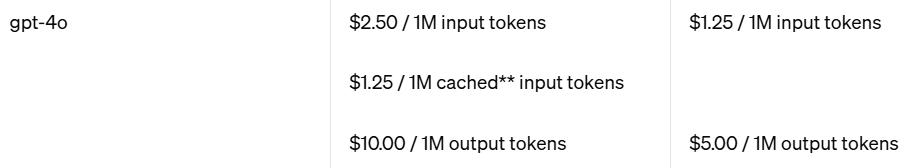

- gpt-4o-mini
  Best cheap,even cheaper than GPT-3.5 Turbo
  The model has 128K context and an October 2023 knowledge cutoff
  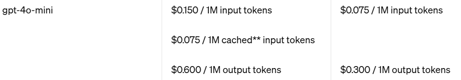

- o1

  Best performance
  

## gpt-4o and gpt-4o mini

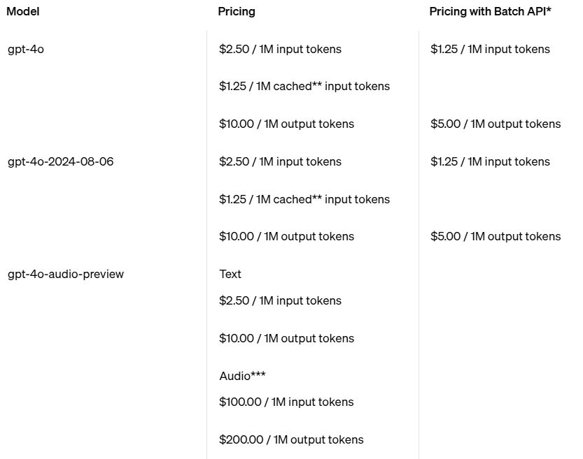

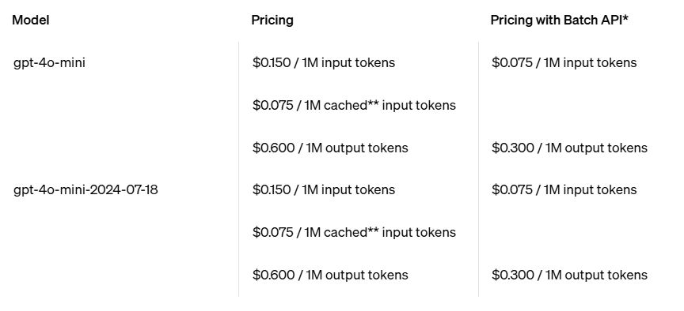

GPT-4o is our most advanced multimodal model that’s faster and cheaper than GPT-4 Turbo with stronger vision capabilities. The model has 128K context and an October 2023 knowledge cutoff.

GPT-4o mini is our most cost-efficient small model that’s smarter and cheaper than GPT-3.5 Turbo, and has vision capabilities. The model has 128K context and an October 2023 knowledge cutoff.

- gpt-4o
- gpt-4o-mini

## o1

Best performance,high price.

o1-preview is our new reasoning model for complex tasks. The model has 128K context and an October 2023 knowledge cutoff.

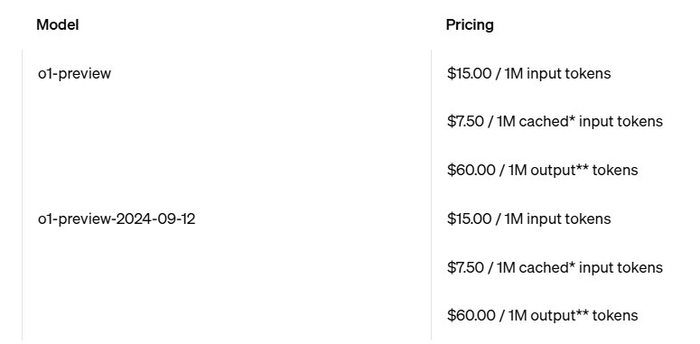

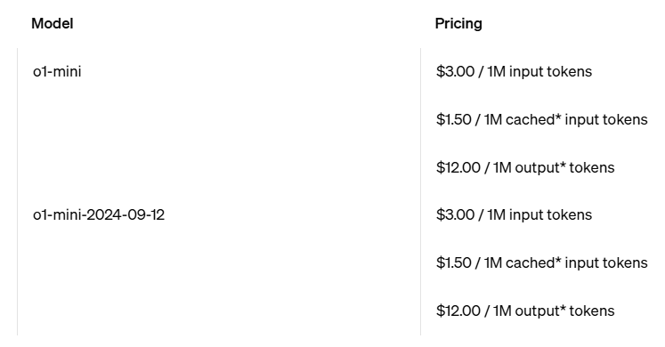

- o1-preview
- o1-mini

## gpt-3.5

Large language model and cheap,but it haven't enough context windows.

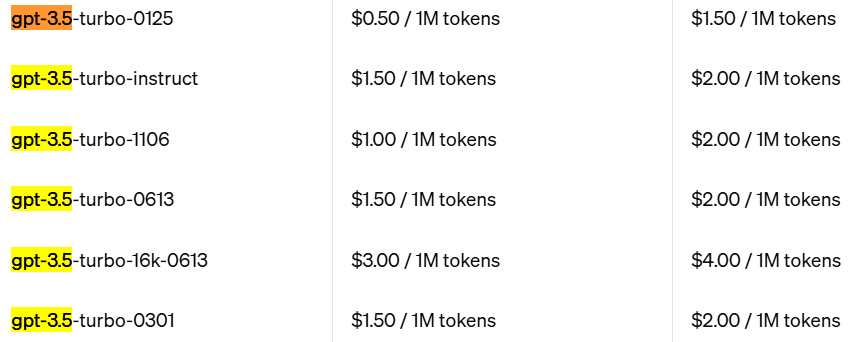

## gpt-4

Too expensive and haven't so much improving.

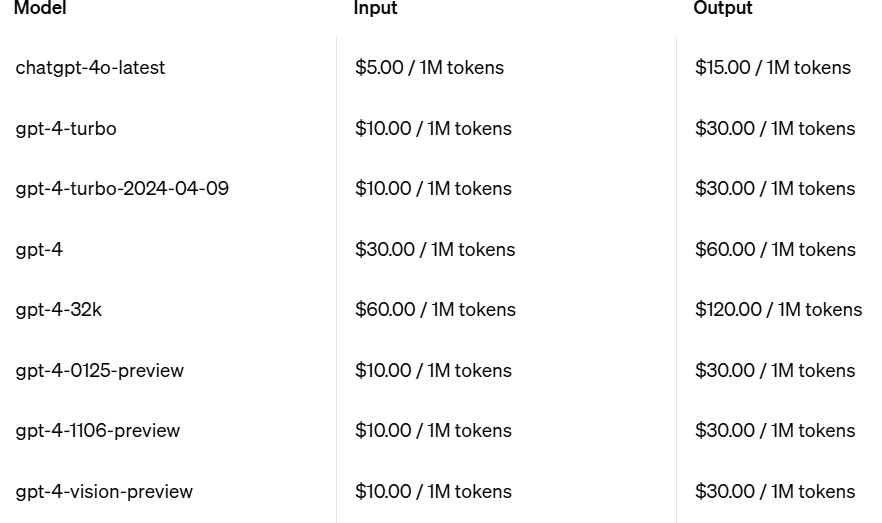

# Fine-tuning

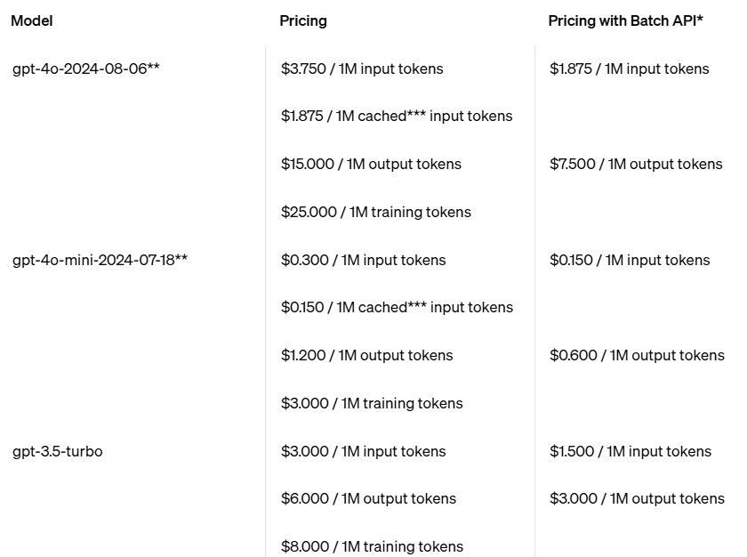

- gpt-4o-2024-08-06**
- gpt-4o-mini-2024-07-18**
- gpt-3.5-turbo

# Embedding

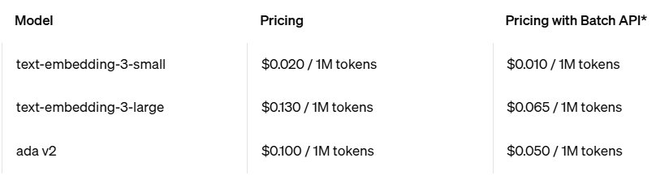

- text-embedding-3-small
- text-embedding-3-large

# Realtime API

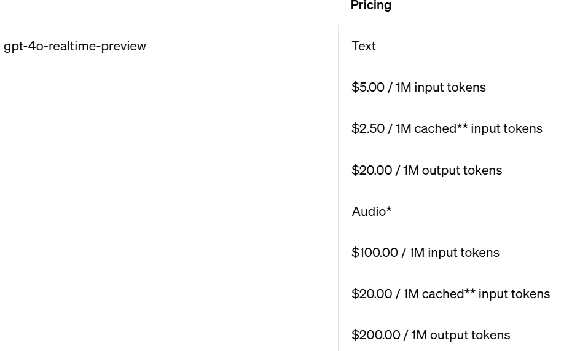

The Realtime API lets developers build low-latency, multimodal experiences, including speech-to-speech capabilities. Text and audio processed by the Realtime API are priced separately.

- gpt-4o-realtime-preview
- gpt-4o-realtime-preview-2024-10-01

# Assistant API

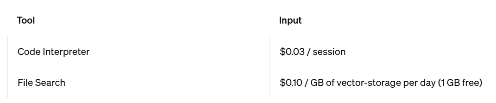

- Code Interpreter
- File Search

# Image models

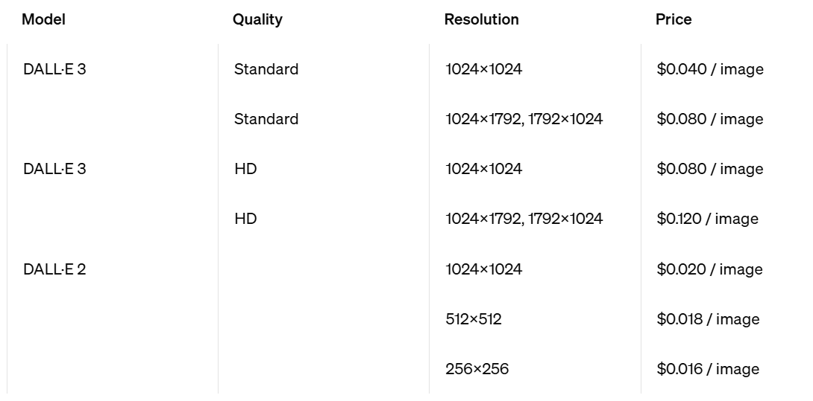

- DALL·E 3
  - Quality
    - Standard
    - HD
  - Resolution
    - 1024×1024
    - 1024×1792, 1792×1024
- DALL·E 2

# Audio Models

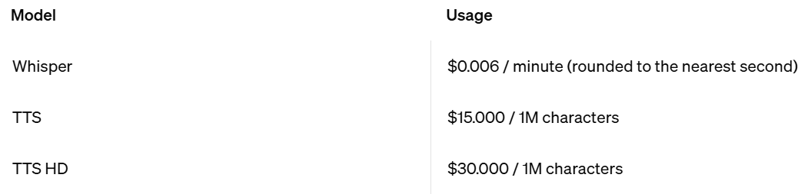

- Whisper
  - speech to text
- TTS
  - text to speech